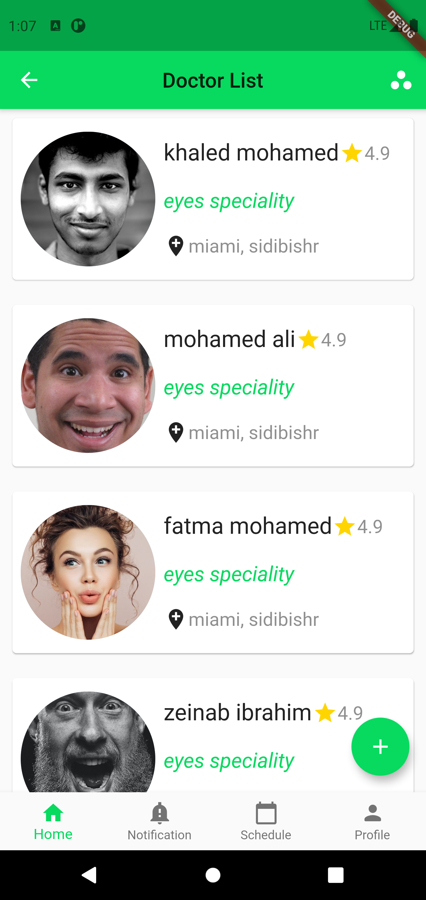
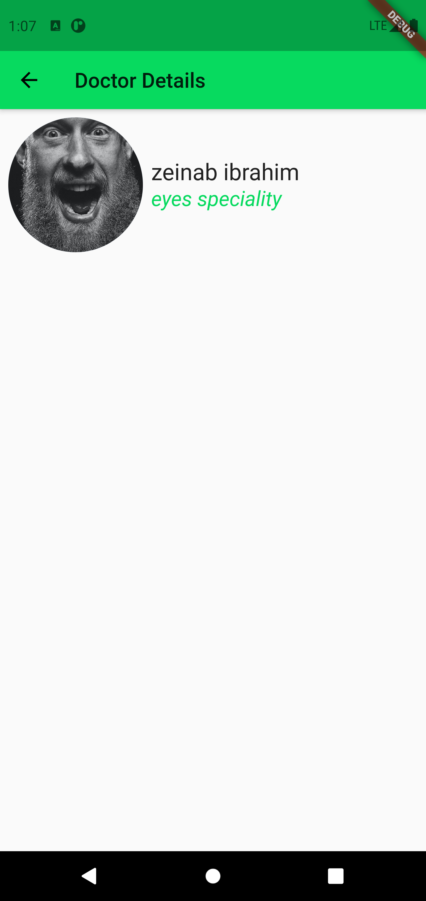

# Doctors Appointments App
This repository is dedicated to a video series that covers basic principles of designing mobile applications using Flutter. This video series can be found here: 
https://youtu.be/efF32JGYlaY
https://youtu.be/FXONsqebjR8
## Technologies Used:
0) Dart SDK
1) Flutter SDK
## Screenshots:

